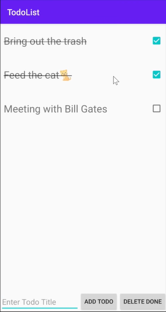

# Kotlin todo list app

<!---Esses são exemplos. Veja https://shields.io para outras pessoas ou para personalizar este conjunto de escudos. Você pode querer incluir dependências, status do projeto e informações de licença aqui--->




> Write down your day todos with a simple and direct android app built with Kotlin. 📱🗒️

### Ajustes e melhorias

## 💻 Prerequisites

Before you start, have sure you have:
<!---Estes são apenas requisitos de exemplo. Adicionar, duplicar ou remover conforme necessário--->
* Installe the most recent version of mais recente de `<android studio / jdk / kotlin>`
* You have a `<Windows / Linux / Mac>`.
* You read this `<guide>`.

## 🚀 Installing <kotlin-todo-list-app>

To install <kotlin-todo-list-app>, Do:

Windows, Linux and macOS:
```
$ git clone https://github.com/Miguel-Oliveiraa/todo-list-kotlin.git
```


## ☕ Using <kotlin-todo-list-app>

To use <kotlin-todo-list-app>, you must:

```
Clone the repository
Open in android studio
Run on your android emulator or in a real device
```

## 📫 Contributing to <kotlin-todo-list-app>
<!---Se o seu README for longo ou se você tiver algum processo ou etapas específicas que deseja que os contribuidores sigam, considere a criação de um arquivo CONTRIBUTING.md separado--->
To contribute to <kotlin-todo-list-app>, follow theses steps:

1. Fork this repository.
2. Create a new branch: `git checkout -b <branch_name>`.
3. Make yours changes and commit: `git commit -m '<commit_message>'`
4. Send to the original branch: `git push origin <kotlin-todo-list-app> / <local>`
5. Create a new pull request.

Alternatively, see the GitHub documentation at [Creating a pull request](https://help.github.com/en/github/collaborating-with-issues-and-pull-requests/creating-a-pull-request).

[⬆ Back to top](#kotlin-todo-list-app)<br>
